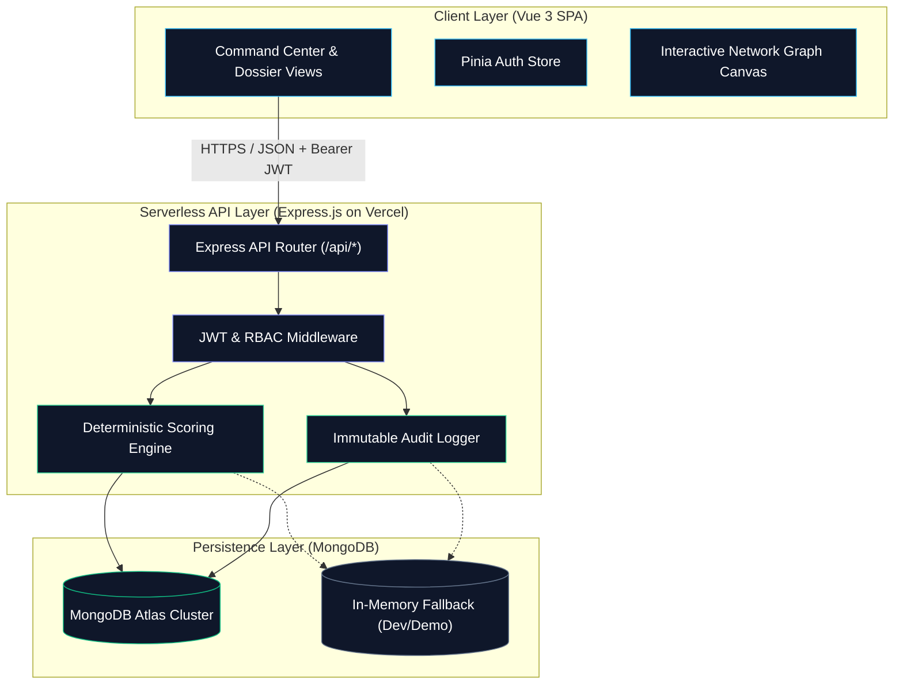

# BlackBox
## Digital Evidence Investigation Platform

[](https://blackbox-investigation-platform.vercel.app/)
[](https://vuejs.org/)
[](https://expressjs.com/)
[](https://www.mongodb.com/atlas)
[](LICENSE)

**BlackBox is a digital evidence investigation platform designed to help investigative teams organize evidentiary artifacts, map relationships between findings, evaluate competing hypotheses through deterministic scoring, and maintain an immutable, verifiable audit trail of all investigative actions.**

**Live Application**: [https://blackbox-investigation-platform.vercel.app/](https://blackbox-investigation-platform.vercel.app/)

---

## Table of Contents

- [Problem](#problem)
- [Solution](#solution)
- [Key Features](#key-features)
- [How It Works](#how-it-works)
- [User Roles & Permissions](#user-roles--permissions)
- [Architecture](#architecture)
- [Technology Stack](#technology-stack)
- [Scoring Engine Mathematics](#scoring-engine-mathematics)
- [Project Structure](#project-structure)
- [API Overview](#api-overview)
- [Getting Started](#getting-started)
- [Environment Variables](#environment-variables)
- [Demo Access & Seeded Scenario](#demo-access--seeded-scenario)
- [Testing & Verification](#testing--verification)
- [Deployment](#deployment)
- [Security Considerations](#security-considerations)
- [Limitations](#limitations)
- [Future Improvements](#future-improvements)
- [Contributing & License](#contributing--license)

---

## Problem

Modern digital investigations involve vast volumes of fragmented, high-velocity evidence spanning server logs, access badges, email communications, and network telemetry. Investigators face several core operational challenges:

1. **Scattered Artifacts**: Evidence is dispersed across incompatible formats without a unified chain of custody or verification framework.
2. **Cognitive Bias & Tunnel Vision**: Teams often latch onto an early theory without systematically testing competing explanations against new data.
3. **Black-Box Decision Making**: Complex investigations require transparent, mathematical justifications for why one theory is favored over another.
4. **Lack of Traceability**: Regulatory, legal, and internal compliance standards require every verification, hypothesis edit, and relationship change to remain permanently auditable.
5. **Access Boundaries**: Different participants—lead investigators, supervisory reviewers, and administrators—require distinct permissions to preserve procedural integrity.

---

## Solution

BlackBox provides a centralized, forensic-grade workspace structured around a clear investigative pipeline:

$$\text{Evidence} \longrightarrow \text{Relationships} \longrightarrow \text{Hypotheses} \longrightarrow \text{Investigation} \longrightarrow \text{Audit Trail}$$

- **Evidence Dossier**: Centralizes digital, physical, and documentary evidence with confidence ratings and verification lifecycles (`VERIFIED`, `UNVERIFIED`, `DISPUTED`, `REJECTED`).
- **Explicit Relationship Mapping**: Links evidence directly to competing hypotheses as **Supporting** or **Contradicting** with configurable strength (1–10).
- **Deterministic Scoring Engine**: Uses transparent mathematical formulas—not opaque machine learning—to score competing theories and generate human-readable explainability logs.
- **Interactive Evidence Graph**: Visualizes the dynamic network between evidence nodes and hypotheses via an interactive canvas graph.
- **Immutable Audit Trail**: Automatically records all mutations, state shifts, and status changes in an append-only ledger for full post-investigation accountability.

---

## Key Features

- **Case Management**: Create, manage, and transition cases through standard forensic lifecycle states (`DRAFT` → `OPEN` → `INVESTIGATING` → `REVIEW` → `RESOLVED` → `ARCHIVED`).
- **Evidence Dossier & Verification**: Categorize digital, physical, and documentary evidence, manage confidence percentages, and advance verification states with peer-review oversight.
- **Competing Hypotheses Management**: Formulate competing theories (e.g., *Insider Threat* vs. *External Compromise*) and dynamically rank them based on empirical evidence weight.
- **Deterministic Scoring & Explainability**: Calculate theory rankings in real-time with step-by-step explanations detailing the exact point contributions of each artifact.
- **Interactive Evidence Network Map**: HTML5 Canvas graph rendering relationships, link polarities (supporting/contradicting), and node weights in real time.
- **Investigation Event Timeline**: Chronological event stream reconstructing the complete narrative evolution of a case.
- **System-Wide Audit Ledger**: Immutable, searchable record of operational events accessible to supervisory reviewers and administrators.
- **Role-Based Access Control (RBAC)**: Server-side authorization protecting administrative actions, case creation, and evidence verification.
- **Zero-Config In-Memory Fallback**: Built-in in-memory database fallback allowing immediate local execution without a pre-configured MongoDB instance.
- **One-Click Demo Seeding**: Instant restoration of the *BK-2041 Aerospace Data Exfiltration* demonstration scenario.

---

## How It Works


1. **Sign In**: An investigator, reviewer, or administrator authenticates via JWT.
2. **Case Creation**: An investigation dossier is initialized with briefing notes, target scope, and priority.
3. **Evidence Collection**: Artifacts (firewall logs, badge access records, email payloads, forensic disk images) are logged with confidence metrics.
4. **Verification & Peer Review**: Evidence is reviewed and assigned a verification state (`UNVERIFIED`, `VERIFIED`, `DISPUTED`, `REJECTED`).
5. **Relationship Mapping**: Evidence items are linked to candidate hypotheses with a specified type (`SUPPORT` or `CONTRADICT`) and strength (1–10).
6. **Dynamic Scoring**: The deterministic scoring engine recalculates hypothesis scores and generates explainability logs.
7. **Graph & Timeline Analysis**: The team evaluates the interactive evidence network and inspects the chronological audit stream.
8. **Review & Case Resolution**: Supervisory reviewers verify the completeness of the investigation and advance the case to `RESOLVED` or `ARCHIVED`.

---

## User Roles & Permissions

BlackBox implements server-side Role-Based Access Control (RBAC) enforced via Express middleware:

| Capability | Investigator | Reviewer | Admin |
|---|:---:|:---:|:---:|
| Authenticate & Access Command Center | Yes | Yes | Yes |
| View Cases, Evidence, & Hypotheses | Yes | Yes | Yes |
| Create New Investigation Cases | Yes | No | Yes |
| Add Evidence Artifacts | Yes | No | Yes |
| Verify / Dispute Evidence States | Yes | Yes | Yes |
| Create & Link Competing Hypotheses | Yes | No | Yes |
| Update Case Lifecycle Status | Yes | Yes | Yes |
| View Case Narrative Timeline | Yes | Yes | Yes |
| View System-Wide Audit Log Ledger | No | Yes | Yes |
| Trigger Demo Scenario Reset | No | No | Yes |

---

## Architecture

```
User (Browser)
      │
      ▼
   Vercel
   ├── Vue 3 + Vite Frontend (Static SPA / CDN)
   └── Express.js Backend API (Serverless Function via /api/*)
             │
             ├── JWT Auth & Role-Based Access Control
             ├── Deterministic Scoring Engine
             ├── Immutable Audit Logger
             │
             ▼
      MongoDB Atlas (or In-Memory Fallback)
      ├── Users
      ├── Cases
      ├── Evidence
      ├── Hypotheses
      ├── EvidenceRelationships
      └── AuditLogs
```



---

## Technology Stack

### Frontend
- **Framework**: Vue 3 (`v3.5.41`) with Composition API (`<script setup>`)
- **Build Tool**: Vite (`v8.2.2`)
- **State Management**: Pinia (`v4.0.3`)
- **Routing**: Vue Router (`v4.6.4`)
- **Styling**: Tailwind CSS (`v4.3.3`) with custom forensic dossier theme
- **Visualization**: HTML5 Canvas with physics-based relationship rendering

### Backend
- **Runtime**: Node.js (CommonJS)
- **Framework**: Express.js (`v5.2.1`)
- **Data Modeling**: Mongoose (`v9.9.4`)
- **Security**: JSON Web Tokens (`jsonwebtoken v9.0.3`) & `bcrypt` (`v6.0.0`)
- **Cross-Origin Handling**: `cors` (`v2.8.6`)

### Database & Deployment
- **Production Database**: MongoDB Atlas
- **Development/Fallback Database**: `mongodb-memory-server` (`v11.2.0`)
- **Hosting Platform**: Vercel (Unified static frontend + Express serverless functions)

---

## Scoring Engine Mathematics

BlackBox utilizes a **deterministic mathematical scoring engine** to evaluate competing hypotheses. This eliminates arbitrary heuristics and provides 100% mathematical defensibility.

### Formula

For a given hypothesis $H$, the score is computed as:

$$\text{Score}(H) = \sum \text{Contribution}_{\text{SUPPORT}} - \sum \text{Contribution}_{\text{CONTRADICT}}$$

The contribution of an individual evidence item $E$ linked with strength $S \in [1, 10]$ is:

$$\text{Contribution}(E) = S \times \left(\frac{\text{Confidence}}{100}\right) \times M_{\text{verification}}$$

### Verification Multipliers ($M_{\text{verification}}$)

| State | Multiplier | Rationale |
|---|:---:|---|
| `VERIFIED` | **1.0x** | Fully authenticated artifact; full mathematical weight applied. |
| `UNVERIFIED` | **0.5x** | Preliminary finding pending peer review; discounted by 50%. |
| `DISPUTED` | **0.2x** | Conflicting or contested finding; discounted by 80%. |
| `REJECTED` | **0.0x** | Disproven or invalid artifact; zeroed out completely. |

### Score Explainability

Every score calculation produces human-readable explainability entries stored on the hypothesis:

```json
[
  "+7.20: Evidence 'E-024: Engineer Badge Access Record' supports (strength 8, confidence 90%, state VERIFIED)",
  "+4.75: Evidence 'E-017: Satellite Telemetry Egress Log' supports (strength 5, confidence 95%, state VERIFIED)",
  "-6.16: Evidence 'E-051: C2 Beacon Network Signature' contradicts (strength 7, confidence 88%, state VERIFIED)"
]
```

---

## Project Structure

```
blackbox/
├── api/                        # Vercel serverless function entrypoints
│   ├── health.js               # Standalone health check handler (/api/health)
│   └── index.js                # Express app serverless entrypoint (/api/*)
├── backend/                    # Backend application source
│   ├── config/
│   │   └── db.js               # MongoDB Atlas connection & in-memory fallback
│   ├── controllers/            # Route controllers (auth, case, evidence, hypothesis, audit)
│   ├── middleware/             # JWT auth & RBAC authorization middleware
│   ├── models/                 # Mongoose schemas (User, Case, Evidence, Hypothesis, Relationship, AuditLog)
│   ├── routes/                 # Express route definitions
│   ├── utils/                  # Deterministic scoring engine & audit logger
│   ├── app.js                  # Express application setup
│   ├── seed.js                 # Demo data seeder (BK-2041 Aerospace scenario)
│   └── server.js               # Local standalone HTTP server entrypoint
├── docs/                       # Architectural & technical documentation
│   ├── API.md                  # Detailed API contract specification
│   ├── ARCHITECTURE.md         # System design details
│   ├── DATABASE.md             # Schema details and relationship diagrams
│   └── SCORING_ENGINE.md       # Scoring formula and explainability specifications
├── frontend/                   # Frontend application source
│   ├── src/
│   │   ├── assets/             # Static graphics and icons
│   │   ├── layouts/            # Main application layout with navigation
│   │   ├── router/             # Vue Router route guards and navigation rules
│   │   ├── store/              # Pinia auth store and token management
│   │   ├── views/              # View components (Dashboard, Cases, CaseDetail, Audit, Login)
│   │   ├── App.vue             # Root Vue component
│   │   ├── main.js             # Vue application initialization
│   │   └── style.css           # Tailwind CSS directives and custom styling
│   ├── index.html              # HTML5 entrypoint
│   └── vite.config.js          # Vite build and proxy configuration
├── .env.example                # Example environment variable template
├── .gitignore                  # Git ignore rules
├── CONTRIBUTING.md             # Contribution guidelines
├── DEPLOYMENT.md               # Production deployment guide
├── LICENSE                     # MIT License
├── package.json                # Root package configuration
├── vercel.json                 # Vercel routing and build configuration
└── README.md                   # Project documentation
```

---

## API Overview

All API endpoints are prefixed with `/api`. Authentication requires a Bearer token in the `Authorization` header (`Authorization: Bearer <token>`).

### Authentication
- `POST /api/auth/login` — Authenticate user and receive JWT. (Public)

### Cases
- `GET /api/cases` — Retrieve all cases. (Investigator, Reviewer, Admin)
- `POST /api/cases` — Create a new investigation case. (Investigator, Admin)
- `GET /api/cases/:id` — Retrieve detailed case dossier. (Investigator, Reviewer, Admin)
- `PUT /api/cases/:id/status` — Update case lifecycle state. (Investigator, Reviewer, Admin)
- `GET /api/cases/:id/timeline` — Retrieve chronological case audit stream. (Investigator, Reviewer, Admin)

### Evidence
- `GET /api/cases/:caseId/evidence` — List evidence artifacts for a case. (Investigator, Reviewer, Admin)
- `POST /api/cases/:caseId/evidence` — Add a new evidence item to a case. (Investigator, Admin)
- `PUT /api/evidence/:id/verify` — Update verification state or confidence score. (Investigator, Reviewer, Admin)

### Hypotheses & Relationships
- `GET /api/cases/:caseId/hypotheses` — List hypotheses ranked by score. (Investigator, Reviewer, Admin)
- `POST /api/cases/:caseId/hypotheses` — Add a new hypothesis to a case. (Investigator, Admin)
- `GET /api/hypotheses/:id/relationships` — List evidence relationships for a hypothesis. (Investigator, Reviewer, Admin)
- `POST /api/hypotheses/:id/relationships` — Create an evidence relationship (`SUPPORT`/`CONTRADICT`). (Investigator, Admin)

### Audit & Administration
- `GET /api/audit` — Query system-wide operational audit logs. (Reviewer, Admin)
- `POST /api/admin/reset-demo` — Wipe database and seed BK-2041 demo scenario. (Admin)
- `GET /api/health` — Service health check. (Public)

---

## Getting Started

### Prerequisites
- **Node.js** (v18 or higher recommended)
- **npm** (v9 or higher)

### 1. Clone the Repository
```bash
git clone https://github.com/Barathwaj2006/blackbox-investigation-platform.git
cd blackbox-investigation-platform
```

### 2. Install Dependencies
```bash
# Install backend dependencies
cd backend
npm install

# Install frontend dependencies
cd ../frontend
npm install

# Return to root
cd ..
```

### 3. Configure Environment Variables (Optional for Local Dev)
For zero-config local testing, the backend will automatically initialize an in-memory database if no `MONGODB_URI` is provided.

To configure custom settings, create a `.env` file in the root or `backend` directory:
```bash
cp .env.example .env
```

### 4. Run the Development Servers

**Terminal 1 (Backend API):**
```bash
cd backend
npm run dev
# Server starts on http://localhost:5000
```

**Terminal 2 (Frontend Client):**
```bash
cd frontend
npm run dev
# Vite dev server starts on http://localhost:5173
```

### 5. Build for Production
To verify the production build locally:
```bash
npm run build
```

---

## Environment Variables

| Variable | Description | Default / Example | Required in Production |
|---|---|---|:---:|
| `PORT` | Local HTTP server port | `5000` | No |
| `NODE_ENV` | Application environment mode | `development` / `production` | Yes |
| `MONGODB_URI` | MongoDB Atlas connection string | `mongodb+srv://<user>:<password>@cluster.mongodb.net/blackbox` | Yes |
| `JWT_SECRET` | Secret key used for signing authentication tokens | `<secure-random-string>` | Yes |

> [!IMPORTANT]
> Never commit live MongoDB credentials, API keys, or production JWT secrets into version control. Configure production environment variables directly in the Vercel dashboard.

---

## Demo Access & Seeded Scenario

The platform includes a pre-seeded forensic scenario: **BK-2041 Aerospace Data Exfiltration**.

### Demo Credentials

| Role | Username | Password | Purpose |
|---|---|---|---|
| **Investigator** | `investigator` | `password` | Primary investigation, evidence entry, and hypothesis linkage |
| **Reviewer** | `reviewer` | `password` | Evidence verification, review oversight, and audit log inspection |
| **Admin** | `admin` | `password` | Full system access and demo scenario reset capability |

### Scenario Overview: BK-2041
- **Incident**: 4.2 GB of encrypted telemetry data exfiltrated from an aerospace research subnet at 03:00 AM.
- **Evidence**:
  - `E-017`: Satellite Telemetry Egress Log (Digital, Verified)
  - `E-024`: Engineer Badge Access Record (Physical, Verified)
  - `E-042`: Suspicious Spear-phishing Email (Digital, Unverified)
  - `E-051`: C2 Beacon Network Signature (Digital, Verified)
  - `E-088`: Cloud Backup Audit Configuration (Document, Verified)
- **Competing Hypotheses**:
  - `H-01`: Insider Threat (Engineering Team)
  - `H-02`: External Compromise (Phishing Pivot)
  - `H-03`: Misconfigured Backup System

To reset the scenario at any time, log in as `admin` and click **Load Demo Case** in the Command Center.

---

## Testing & Verification

- **Production Build Verification**: The frontend compiles cleanly with Vite (`vite build`) producing optimized client assets in `frontend/dist/`.
- **API Contract Verification**: All API endpoints enforce strict schema validation via Mongoose and role-based permissions via Express middleware.
- **Scoring Engine Mathematics**: Verified deterministic recalculation across evidence state transitions (`UNVERIFIED` → `VERIFIED` → `DISPUTED` → `REJECTED`).
- **Database Fallback Verification**: Zero-config in-memory database verified for immediate local onboarding without external infrastructure.

---

## Deployment

The application is deployed as a unified architecture on **Vercel** backed by **MongoDB Atlas**.

```
https://blackbox-investigation-platform.vercel.app/
```

- **Frontend**: Built with Vite and served via Vercel Edge Network CDN.
- **Backend API**: Serverless Express function mounted at `/api/*` defined in `vercel.json` and `api/index.js`.
- **Database**: Dedicated MongoDB Atlas cluster with cached connection pooling.

For complete deployment and environment configuration steps, see [DEPLOYMENT.md](DEPLOYMENT.md).

---

## Security Considerations

- **Server-Side Authentication**: All protected routes require a signed JWT validated via the `protect` middleware.
- **Password Hashing**: Passwords are encrypted using `bcrypt` with 10 salt rounds prior to persistence.
- **Role-Based Authorization**: Route-level RBAC middleware ensures users cannot perform operations exceeding their assigned role.
- **Injection Protection**: Mongoose schema modeling and parameterized queries prevent NoSQL injection vulnerabilities.
- **Secret Isolation**: All credentials, tokens, and database URIs are loaded strictly via environment variables.

---

## Limitations

- **Attachment Storage**: Evidence artifacts store metadata, confidence metrics, and descriptive logs; large raw binary file uploads (e.g., multi-gigabyte disk images) are currently represented as metadata records rather than direct cloud object storage blobs.
- **Real-Time Collaboration**: Updates are requested via standard REST queries upon user action rather than bidirectional WebSockets.
- **Single-Tenant Scope**: Designed as a single-organization investigation platform for hackathon demonstration.

---

## Future Improvements

1. **Cloud Object Storage (S3 / GCS)**: Direct presigned URL uploads for multi-gigabyte PCAP files and forensic disk images.
2. **STIX / TAXII Export**: Export investigation evidence maps and threat actor hypotheses into standard cyber threat intelligence formats.
3. **Multi-Tenant Workspaces**: Organization-level isolation and team-specific case assignments.
4. **Automated Threat Intelligence Ingestion**: Integration with external enrichment APIs (e.g., VirusTotal, AlienVault OTX) to automatically populate confidence scores.
5. **PDF Executive Briefing Generator**: One-click generation of court-admissible forensic PDF dossier summaries.

---

## Contributing & License

Contributions, issue reports, and feedback are welcome. Please consult [CONTRIBUTING.md](CONTRIBUTING.md) for guidelines.

This project is licensed under the [MIT License](LICENSE).
